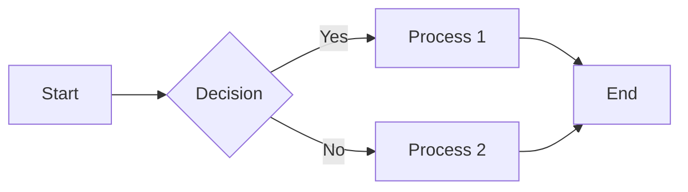

# markdown_mermaid_demo
some text

```mermaid
graph LR
    A[Start] --> B{Decision}
    B -- Yes --> C[Process 1]
    B -- No --> D[Process 2]
    C --> E[End]
    D --> E
```

```
 mmdc -i  graph.mmd -o graph.mmd.svg -b white    
```


