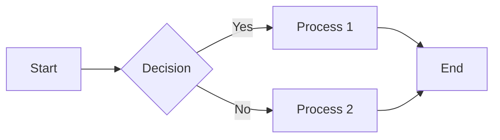

# markdown_mermaid_demo

* tool for generating diagrams and flowcharts (and more)
* instead of exporting from other tools, text based searchable and versionable
* [mermaid](https://mermaid-js.github.io/mermaid/#/)
* Used in GitHub READMEs, documentation, technical blogs, and reports.
* online https://mermaid.live
* https://plugins.jetbrains.com/plugin/20146-mermaid

## types of diagrams

1. Flowchart: Used for representing workflows or processes, showing steps in a sequence and their decision points.
1. Sequence Diagram: Illustrates how objects interact in a particular scenario of a use case, showing the sequence of messages exchanged between the objects.
1. Gantt Chart: Useful for project management, showing a timeline view of tasks, durations, dependencies, and completion status.
1. Class Diagram: Represents the structure of a system by showing its classes, attributes, operations, and the relationships between the classes.
1. State Diagram: Describes the states and state transitions of a system or a business process.
1. Entity Relationship Diagram (ERD): Used in database modeling to illustrate the logical structure of databases, showing entities, their attributes, and the relationships between them.
1. User Journey Map: Visualizes the experience of a user through a product, typically showing the different stages a user goes through and their interactions with the product.
1. Pie Chart: A circular statistical graphic, which is divided into slices to illustrate numerical proportion.
1. Requirement Diagram: Specifically designed for requirement engineering, to represent requirements, their relationships, and their dependencies in a structured way.
1. Component Diagram (UML): Represents how a software system is split up into components and shows the dependencies among these components.
1. Git Graph: Visualizes Git branching and version histories.




```
 mmdc -i  graph.mmd -o graph.mmd.svg -b white    
```



